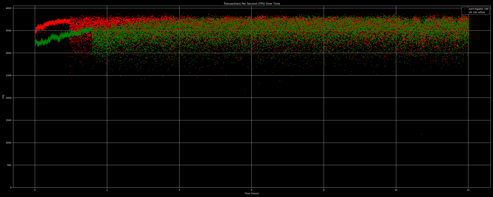
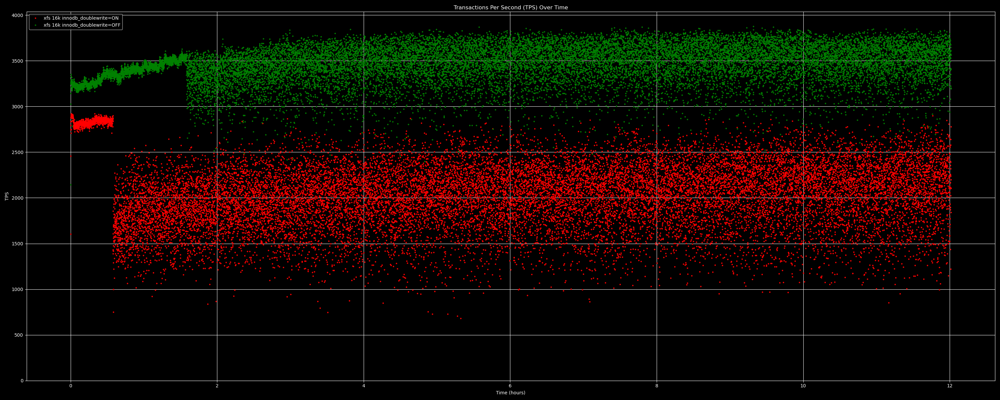
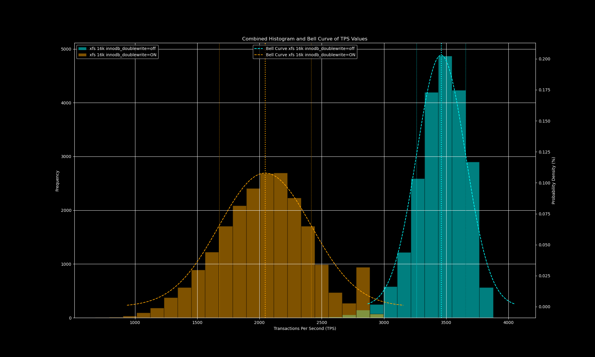
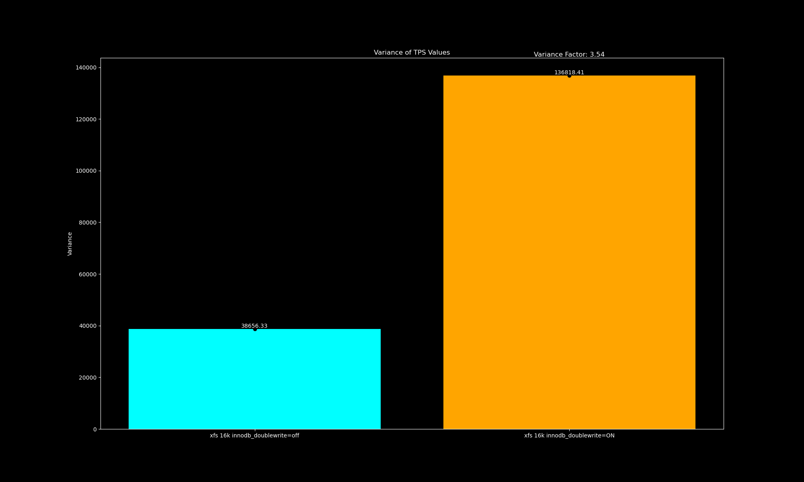
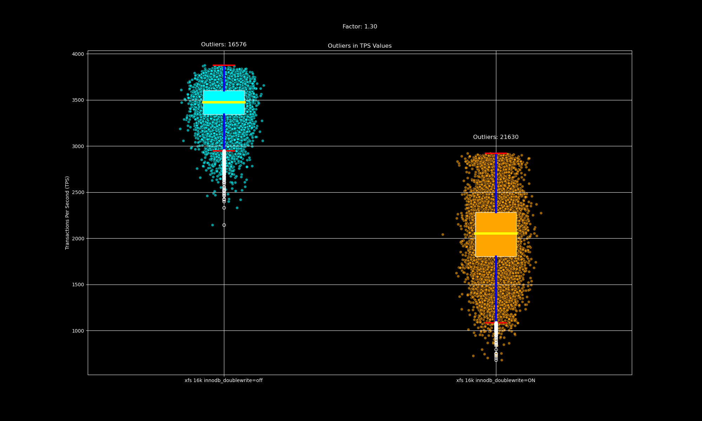
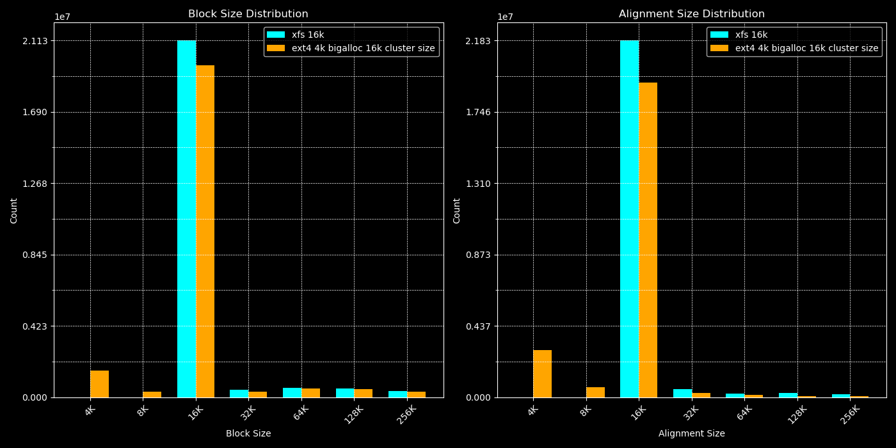

Pre LBS upstream alignment tests and MySQL TPS variability results
==================================================================

This is a collection of blkalgn test results with LBS before LBS got merged and
so these are relatively outdated plots but enough of a proof of concept plots.
kdevops already supports doing these tasks / plots in an automated way for any
kernel and so they should be re-run with a more modern kernel. For example,
Kundan's block folio patches were merged on v6.12-rc1 along with LBS and those
should affect performance in a positive way.

AWS i4i.4xlarge instance was used with debian-12 image, docker mysql and
sysbench images.

Support for testing all this is now automated in
[kdevops](https://github.com/linux-kdevops/kdevops).

# Summary of results

  * We see 3-4x MySQL TPS variability gains when testing against NVMe.
  * We see 1.3x MySQL TPS outlier reduction when testing against NVMe.

LBS provides alignment determinism. Future LBS work, which would also
enable setting the filesystem sector size to 16k means absolutely no IO
below the filesystem block size (FSB) is issued. These alignment requirements
used for LBS can be leveraged for avoiding torn writes.

Comparison against ext4 with bigalloc 16k shows parity results over 12 hour runs
and this was without Kundan's block layer folio changes. We expect v6.12-rc1 and
future kernels to perform better with XFS on 16k.

# Definitions

## TPS variability

We define the TPS variability the square of the standard deviation.

## TPS outliers

Outliers are TPS values 1.5 outside (IQR)[https://en.wikipedia.org/wiki/Interquartile_range].
There is likely a better value other than 1.5, a database expert should provide
input here.

# Image highlights

## TPS changes

### xfs 16k vs ext4 bigalloc 16k - 12 hour MySQL run

This compares XFS with 16k block size filesystem against ext4 using a 4k
block size and 16k bigalloc cluster size.

### xfs 16k the effects of disabling the double write buffer

This compares running XFS with a 16k block size filesystem on two nodes, with
one node with the double write buffer enabled Vs on the other node the double
write buffer disabled.

TPS results:

Visualizing TPS variability

TPS variability factor change:

Visualizing TPS outliers

kdevops has a way to do a factor analysis.

## Alignment checks

Alignment checks are important because of the atomic alignment requirements.
Without proper max 16k alignment for 16k awupf drive you risk data loss.
Most IOs should also be of the max atomic allowed, for nvme that's awupf.

### xfs 16k sector size on x86_64 (not yet upstream)

1 million 4k file tests.
                                                                                 

### xfs 16k Vs ext4 bigalloc 16k - 12 hours MySQL run

Tools used
==========

wget https://raw.githubusercontent.com/dkruces/bcc/lbs/tools/blkalgn.py

The main source of the work is this simple tree:

https://github.com/mcgrof/plot-sysbench

Workflows tested
================

There are two sets of tests run:

  * 1 million files written of size 4k, see bin/fio-1-million-example.sh
  * MySQL 12 hour runs read ./24-tables-512-threads/README.md

We've moved!
============

All this is hacky and difficult to reproduce.. and so this has now all been
ported over to easily be run with kdevops as follows:

make defconfig-sysbench-mysql-atomic-tps-variability
make -j$(nproc)
make bringup
make sysbench
make sysbench-test

Results will be placed in ./workflows/sysbench/results/

We expect to also extend support with PostgreSQL.

Everything is defined through Kconfig, and so to support a cloud provider
all you need to do is extend modify SYSBENCH_DEVICE so the correct
drive is used in workflows/sysbench/Kconfig.fs. For example right now
if libvirt is used and virtio is used /dev/disk/by-id/virtio-kdevops1 is used
if libvirt is used and nvme   is used /dev/disk/by-id/nvme-QEMU_NVMe_Ctrl_kdevops1 is used
if the AWS m5ad_4xlarge instance is used  /dev/nvme2n1 is used and
if OCI is used the sparse volume defined in TERRAFORM_OCI_SPARSE_VOLUME_DEVICE_FILE_NAME
is used.

Experience shows at least that AWS needs also some pre-run work to ensure all
extra data for docker is on a partition which won't fill /. Future work to
kdevops shoudld be done for cloud providers per type of target instance to
adjust data.

Libvirt with PCI passthrough is also possible just as we can test fstets in
kdevops with PCI passthrough, that just needs a bit of love and testing.
