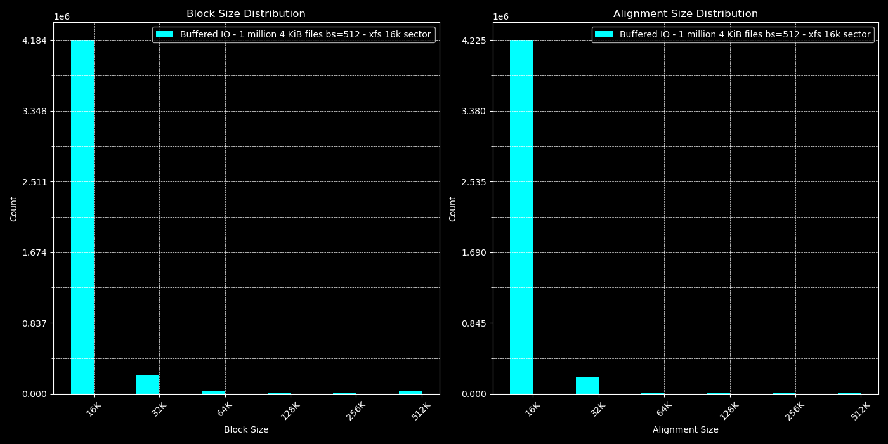

Pre LBS upstream alignment tests and MySQL TPS variability results
==================================================================

This is a collection of blkalgn test results with LBS. It also includes
MySQL TPS variability tests and results. We document each directory meaning
below. This was before LBS was merged and most of the tests were originally
done without support for large folios on the block layer for direct IO
(without Kundan's block layer folio pages). Kundan's patches proved to
help with alignment, even for the buffered IO cases even though we have proven
even writeback for buffered IO does not touch any of the DIO path, however
results did show improvement in larger IOs when buffered IO is used with
his patches applied. All in all, these test are severely outdated now that
both LBS patches are merged and Kundan's patches are merged. We expect much
better results.

AWS i4i.4xlarge instance was used with debian-12 image, docker mysql and
sysbench images.  The simple scripts in this project were used:

Summary of results
==================

We see 3-4x MySQL TPS variability gains when testing against NVMe.
We see ...  PostgresQL TPS variability gains when testing against NVMe
(coming to kdevops soon).

LBS provides alignment determinism. Future LBS work, which would also
enable setting the filesystem sector size to 16k means absolutely no IO
below the filesystem block size (FSB) is issued. These alignment requirements
used for LBS can be leveraged for avoiding torn writes.

Comparison against ext4 with bigalloc 16k shows parity results over 12 hour runs
and this was without Kundan's block layer folio changes. We expect v6.12-rc1 and
future kernels to perform better with XFS on 16k.

Image highlights
================

Using xfs 16k sector size on x86_64 (not yet upstream) 
                                                                                 

Tools used
==========

wget https://raw.githubusercontent.com/dkruces/bcc/lbs/tools/blkalgn.py

The main source of the work is this simple tree:

https://github.com/mcgrof/plot-sysbench

Workflows tested
================

There are two sets of tests run:

  * 1 million files written of size 4k, see bin/fio-1-million-example.sh
  * MySQL 12 hour runs read ./24-tables-512-threads/README.md

We've moved!
============

All this is hacky and difficult to reproduce.. and so this has now all been
ported over to easily be run with kdevops as follows:

make defconfig-sysbench-mysql-atomic-tps-variability
make -j$(nproc)
make bringup
make sysbench
make sysbench-test

Results will be placed in ./workflows/sysbench/results/

We expect to also extend support with PostgreSQL.

Everything is defined through Kconfig, and so to support a cloud provider
all you need to do is extend modify SYSBENCH_DEVICE so the correct
drive is used in workflows/sysbench/Kconfig.fs. For example right now
if libvirt is used and virtio is used /dev/disk/by-id/virtio-kdevops1 is used
if libvirt is used and nvme   is used /dev/disk/by-id/nvme-QEMU_NVMe_Ctrl_kdevops1 is used
if the AWS m5ad_4xlarge instance is used  /dev/nvme2n1 is used and
if OCI is used the sparse volume defined in TERRAFORM_OCI_SPARSE_VOLUME_DEVICE_FILE_NAME
is used.

Experience shows at least that AWS needs also some pre-run work to ensure all
extra data for docker is on a partition which won't fill /. Future work to
kdevops shoudld be done for cloud providers per type of target instance to
adjust data.

Libvirt with PCI passthrough is also possible just as we can test fstets in
kdevops with PCI passthrough, that just needs a bit of love and testing.
